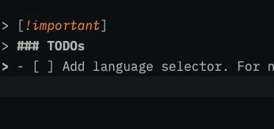

# popclip-translate-shell
Instant wrapper of Translate-shell for popclip

### Requirements
- [Translate-shell](https://github.com/soimort/translate-shell) installed and accessible in bash
- Popclip v2022 or later

> [!important]
> ### TODOs
> - [ ] Add language selector. For now Persian is the default target
> - [ ] RTL languages need `rev` command, while others don't
